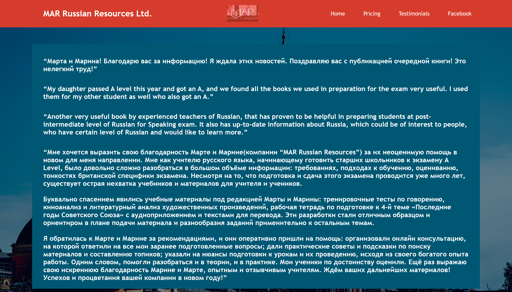
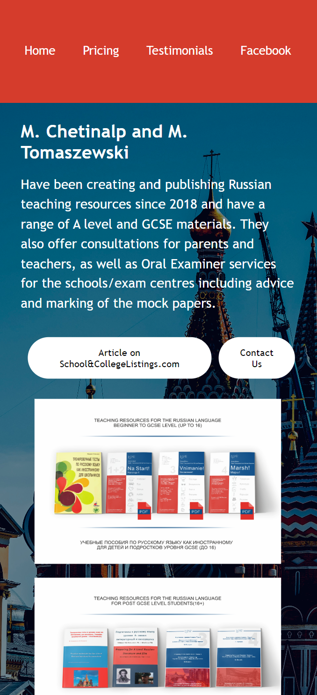
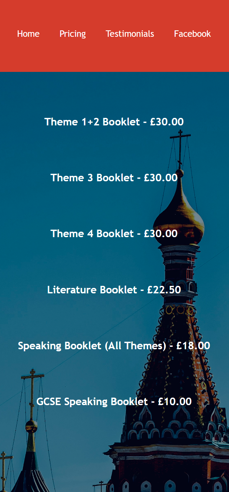

# MAR Teaching Resources Business Website
#### Video Demo:  <https://youtu.be/BgDHBlEyg9g>
#### Description:

This is a website created to display the teaching resources of my old Russian teacher and her business partner. For a year, they have been simply sending interested customers pdf copies of the covers of each of their products on offer. This was time-consuming, not customer-friendly, unorganized, and unappealing. To boost their customer retention and viewership to purchase ratio, I decided to take some stress off her by developing a website to store all of these resources, free of charge.

The homepage of the website is split into 3 distinct sections all wrapped in a hero-container class that creates padding around the sections to isolate them from the borders of the page, revealing more of the high-quality copyright-free backdrop image (also styled to fill exactly the entirety of the image at 95vh as 5vh is taken up by the navigation bar which will be mentioned later). 
- Firstly, the red navigation bar at the top of the screen contains the company name and logo as well as links to access the "pricing", "testimonials", and "Facebook" hyperlinked pages. The company name, of class logo, is aligned with the left of the bar spelling out the full company name in bold. More central, is the image logo which was adjusted to be surrounded with the same color as the navigation bar itself. The hyperlinked pages are aligned on the right in distinct font style with equal spacing between each element. On hover, the hyprerlinks turn a certain shade of blue, matching the color of the sky in the background image. The navigation bar is designed to remain constant across each hyperlinked page so that the user can redirect themselves onto any section of the website using that feature regardless of which one they are currently on. 

- The container class column-left encloses a short description of the product that the business owners are providing. Above the description is a bold heading of the names of the business owners that is separated by line breaks from the main text to fill in the empty space at the top of the page as per the website owner's specifications. In addition to this, there are two borderless oval-shaped buttons: "Article on School&CollegeListings.com" links to an article with the business partners presenting their product at a prestigious teacher's conference in London, and "Contact Us" uses the mailto functionality HTML provides to, when pressed, open the user's default emailing app, and automatically initialize an email draft to the work address of the owners. For stylistic purposes, these buttons also inverse color on hover (white on red instead of red on white) which aligns with the color theme of the website.

- The container class column-right starts 60% across from the left side so is smaller and indeed simpler than the previous section. It encloses two .png images vertically aligned with one another other that shows an overview of the products on offer.

The pricing page has 3 column sections, all inheriting from the class column-right. It shows the 6 individual booklets that are up for sale on the site along with their respective prices centered above each item with a line break between the elements.

The testimonials page has just one section with an adjusted class, column-testimonial. This class has similar characteristics to precious columns; however is adjusted to have a solid background color similar to that of the existing image behind it to make the reviews easier to read.

#### Mobile Capabilities:

Knowing that a majority of people linked the website would access it from a mobile device, I decided to make adjustments to the code if the device is thinner than a threshold number of pixels.

Adjustments on index.html (homepage):
- Navigation bar stretched vertically to account for iPhone screen camera.
- Removed logo and name alements from navigation bar.
- Reduced spacing between hyperlinked pages and center aligned them on navigation bar.
- Made all sections align vertically instead of be side-by-side.
- Decreased font size of the business owner's names to leave space for other elements.
- Hid old buttons using "display: none" and created new class for new button container to align them horizontally rather than vertically as well as chnaging size and spacing between them.
- Resized images to fit below the buttons.

- 

Adjustments on pricing.html:
- Hid all previous elements.
- Created new headings pricing each product on offer and center aligned them, leaving a large margin-top between each to take up the length of the page.

- 

Surprisingly, no adjustments for testimonials.html were needed.
